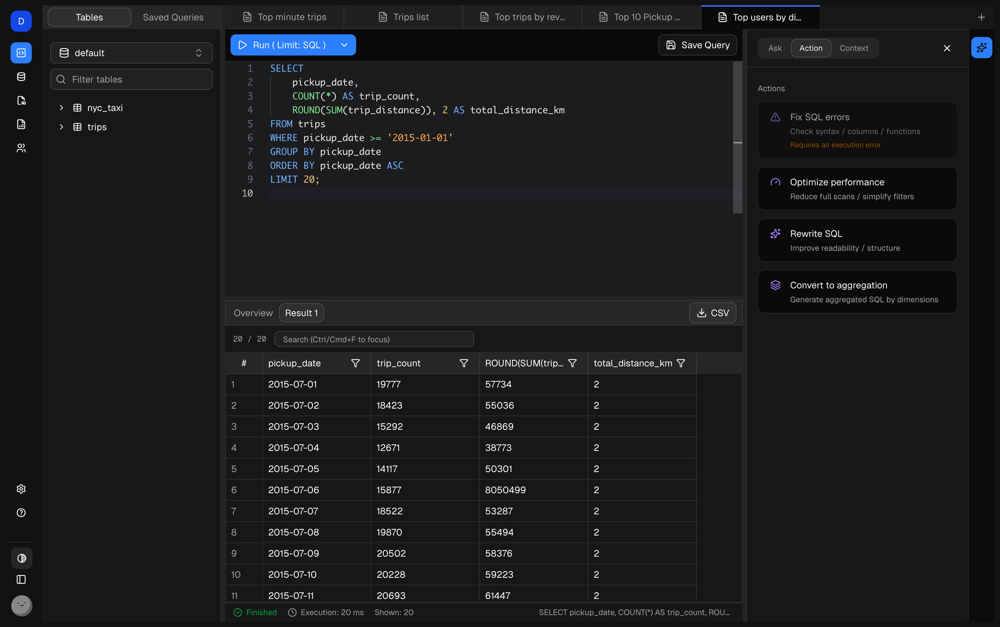

# Dory


**Dory is an AI-native SQL workspace for modern databases.**  

> The AI-powered Data Studio you’ve been waiting for.

It combines intelligent SQL editing, context-aware AI assistance, conversational database exploration, and deep operational integration across modern databases into a single unified workspace — helping engineers and analysts write, understand, and manage data more efficiently.

<!-- > Explore data with SQL and AI, together. -->

<p align="center">
  <a href="https://demo.getdory.dev"><b>🚀 Try Live Demo</b></a> &nbsp; • &nbsp;
  <a href="#quick-start"><b>📦 Quick Start</b></a> &nbsp; • &nbsp;
  <a href="https://github.com/dorylab/dory/stargazers"><b>⭐ Star</b></a>
</p>

**No signup required. Click “Enter as Demo” to start instantly.**

**👇 Live Playground: https://demo.getdory.dev**



## 🚀 Quick Start
### Run with Docker

Make sure Docker is installed, then run:

```bash
docker run -d --name dory \
  -p 3000:3000 \
  -e TRUSTED_ORIGINS="http://localhost:3000" \
  -e DS_SECRET_KEY="$(openssl rand -base64 32 | tr -d '\n')" \
  -e BETTER_AUTH_SECRET="$(openssl rand -hex 32)" \
  -e DORY_AI_PROVIDER=openai \
  -e DORY_AI_MODEL=gpt-4o-mini \
  -e DORY_AI_API_KEY=your_api_key_here \
  -e DORY_AI_URL=https://api.openai.com/v1 \
  dorylab/dory:latest

```
### 🧠 Supported AI Providers

Dory is built with a pluggable AI provider architecture.
You can freely switch between different model vendors by changing environment variables — no code changes required.

Currently supported providers:

| Provider | Env `DORY_AI_PROVIDER` | Description |
|----------|-------------------------|-------------|
| OpenAI | `openai` | Default provider. Uses official OpenAI API. |
| OpenAI-Compatible | `openai-compatible` | Any service exposing an OpenAI-compatible API. |
| Anthropic | `anthropic` | Claude models via Anthropic official API. |
| Google | `google` | Gemini models via Google Generative AI API. |
| Qwen (Alibaba) | `qwen` | Qwen models via DashScope OpenAI-compatible endpoint. |
| xAI | `xai` | Grok models via xAI API. |


## ✨ Key Features

### 🧠 SQL Copilot

An AI assistant grounded in real database schema and current query context.

- **Ask** — Generate SQL from natural language  
- **Action** — Fix or rewrite the current SQL  
- **Context** — Explain query logic and field semantics  

AI that understands your database — not just text completion.

---

### ⌨️ Schema-Aware Autocomplete

- SQL completion based on real database schema  
- Suggests tables, columns, functions, and aliases  
- Supports multi-table joins and subqueries  

---

### ✍️ Intelligent SQL Editor

- Multi-tab SQL editing and execution  
- Saved frequently used queries  
- Deep integration with SQL Copilot  

---

### 💬 Database Chatbot

- Built-in conversational AI assistant  
- Automatically understands connected database schema  
- Ask questions directly about tables and SQL  
- Quickly locate field meanings and query ideas  

---

### 📈 ClickHouse Monitoring (Deep Integration)

A native observability interface designed specifically for ClickHouse.

- Real-time metrics:
  - Total queries  
  - Slow queries  
  - Error queries  
  - Active users  
- Query latency trends (P50 / P95)  
- Query throughput trends (QPM)  
- Multi-dimensional filtering:
  - User  
  - Database  
  - Query type  
  - Time range  

---

### 🔐 ClickHouse Privileges (Deep Integration)

Native ClickHouse user and role management UI.

- Create, edit, and delete database users  
- Create roles and configure grant relationships  
- Configure:
  - Login username and password  
  - Allowed host addresses  
  - Granted roles and default roles  
- Supports cluster-level privilege operations (On Cluster)  
- No need to manually write GRANT / CREATE USER SQL  

---

## 🔌 Database Support

| Database     | Status              |
|--------------|---------------------|
| ClickHouse   | ✅ Deeply integrated |
| PostgreSQL  | 🚧 In development   |
| MySQL       | 🚧 Planned          |
| DuckDB      | 🚧 Planned          |
| SQLite      | 🚧 Planned          |

---

## ⚙️ Tech Stack

- Next.js + React + Tailwind
- Drizzle ORM  
- Multi-model AI SDK integration
- PGLite
- Resend
- Shadcn UI
- Monaco Editor

---

## 🎯 Who is it for?

- Data engineers  
- Data analysts  
- Database platform teams  
- ClickHouse operations teams  

---

## 🚀 Getting Started

> Docker one-click deployment
> Desktop client (Mac) coming soon  

---

## 📄 License

Apache-2.0
