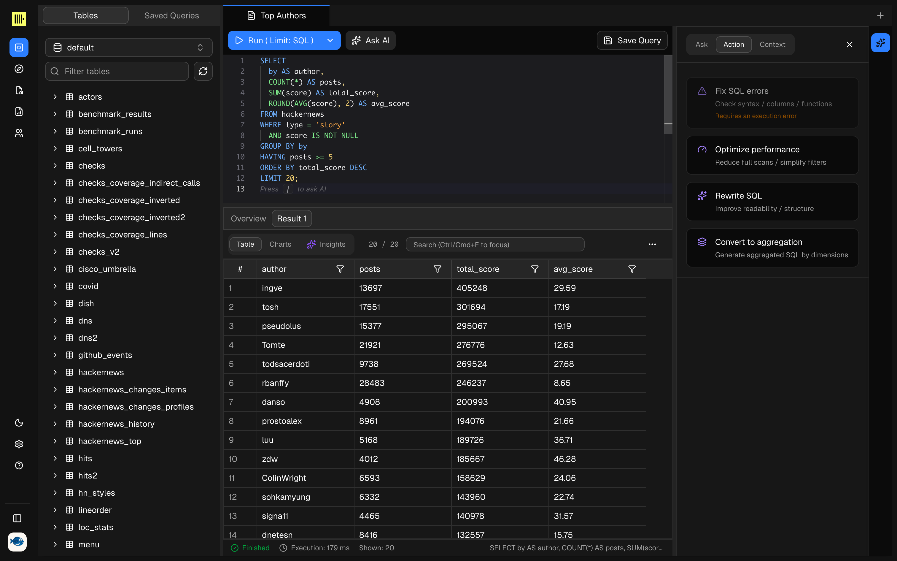

<p align="center">
  
</p>

<h1 align="center">Dory</h1>

**Dory is an AI-native SQL client for humans and agents.**

Dory is a SQL workspace where humans can query, explore, and visualize data, and where AI agents can safely work with databases through MCP.

Unlike a plain database MCP server that only sends query results back to a chat, Dory turns agent work into editable SQL workspaces: SQL tabs, result sets, charts, saved queries, and execution context can all be opened, inspected, modified, and continued by humans.

Use Dory as your everyday SQL client, or as the database execution layer for agents like Claude Code, Codex CLI, and other MCP-compatible tools.

<p align="center">
  <a href="https://app.getdory.dev"><b>🚀 Try Live Demo</b></a> &nbsp; • &nbsp;
  <a href="#install-on-macos-with-homebrew"><b>🍺 Install via Homebrew</b></a> &nbsp; • &nbsp;
  <a href="https://github.com/dorylab/dory/releases"><b>🍎 Download for macOS</b></a> &nbsp; • &nbsp;
  <a href="https://github.com/dorylab/dory/releases"><b>Download for Windows</b></a> &nbsp; • &nbsp;
  <a href="#quick-start"><b>📦 Quick Start</b></a> &nbsp; • &nbsp;
  <a href="https://www.getdory.dev/docs/deploy/self-hosting"><b>🏠 Self-Hosting</b></a> &nbsp; • &nbsp;
  <a href="./docs/contributing.md"><b>🤝 Contributing</b></a> &nbsp; • &nbsp;
  <a href="https://github.com/dorylab/dory/stargazers"><b>⭐ Star</b></a>
</p>

**No signup required. Click "Sign in as demo" to start instantly.**

**👇 Live Playground: https://app.getdory.dev**



## Why Dory?

AI agents can now write SQL, inspect schemas, and answer analytical questions. But raw agent output is not enough for real data work.

Teams still need to:

- see the exact SQL that was run
- inspect real result sets
- fix wrong queries
- turn results into charts or exports
- preserve context across multiple steps
- continue the work in a real SQL workspace

Dory is built for this workflow.

## How Dory works

Dory provides the same underlying database actions to both the UI and agents:

- Humans use Dory as a SQL client: write SQL, browse schema, run queries, filter results, create charts, and save queries.
- Agents use Dory through MCP: list connections, explore schemas, run read-only SQL, create tabs, and organize database work.
- Agent-generated work becomes a real workspace that humans can review, edit, and continue.

## Dory vs a plain database MCP server

| Capability | Plain DB MCP Server | Dory |
| --- | ---: | ---: |
| Run SQL from agents | ✅ | ✅ |
| Explore schema | ✅ | ✅ |
| Editable SQL tabs | ❌ | ✅ |
| Persistent result sets | ❌ | ✅ |
| Charts and filters | ❌ | ✅ |
| Human review workflow | Limited | ✅ |
| Saved queries and workspace context | Limited | ✅ |
| Works as a daily SQL client | ❌ | ✅ |

## ✨ Key Features

### Editable Agent Workspaces

Agent database work should not disappear into a chat transcript.

- Open agent-created SQL tabs as normal workspace tabs
- Inspect SQL, result sets, filters, charts, and saved context
- Edit generated SQL and rerun it yourself
- Continue an agent run from the same workspace instead of restarting from scratch

---

### Desktop MCP for Claude Code / Codex CLI

The Dory desktop app exposes a local MCP endpoint so external agents can use your Dory connections without manual token copy/paste.

- Works with Claude Code, Codex CLI, and other MCP-compatible clients
- Uses Dory's connection list, schema inspection, saved queries, and read-only SQL execution
- Keeps Desktop MCP grants managed by Dory instead of asking normal users to handle API tokens

---

### SQL Workspace for Humans

- Multi-tab SQL editor with multiple result sets
- Schema browser for tables, columns, and database objects
- Saved queries for reusable analysis
- Built-in query execution history and workspace context

---

### Result Sets, Filters, and Charts

- Inspect real result sets in a table view
- Filter, search, and review returned rows
- Turn query output into charts directly inside the workspace
- Keep results attached to the SQL that produced them

---

### Schema-aware AI Assistance

An AI assistant grounded in real database schema and current query context.

- Generate SQL from natural language
- Rewrite, fix, and explain SQL in the current tab
- Use current database schema and query context
- Keep AI assistance inside the real SQL workspace

---

### Saved Queries and Reusable Context

- Save useful SQL as reusable queries
- Organize query work across connections and workspaces
- Let humans and agents build on previous database work
- Preserve context beyond a single chat response

---

### Database Support

Dory is a multi-database SQL client, with broad driver support and deeper integrations where Dory can provide more than generic SQL execution.

| Database | Status |
| --- | --- |
| ClickHouse | ✅ Deeply integrated |
| PostgreSQL | ✅ Supported |
| Neon | ✅ Supported |
| MySQL | ✅ Supported |
| MariaDB | ✅ Supported |
| SQLite | ✅ Supported |
| DuckDB | ✅ Supported |
| SQL Server | ✅ Supported |
| Oracle | ✅ Supported |
| Snowflake | 🚧 Planned |

---

### ClickHouse Deep Integration

Dory includes native ClickHouse operations surfaces for teams that need more than a generic SQL editor.

- Query monitoring with slow queries, errors, active users, latency, and throughput
- Multi-dimensional filtering by user, database, query type, and time range
- User and role management without hand-writing every `GRANT` or `CREATE USER` statement
- Cluster-level privilege operations with On Cluster support


## 🚀 Quick Start

### Install on macOS with Homebrew

```bash
brew install dorylab/dory/dory
```

### Run with Docker

Make sure Docker is installed, then run:

```bash
docker run -d --name dory \
  -p 3000:3000 \
  -e DS_SECRET_KEY="$(openssl rand -base64 32 | tr -d '\n')" \
  -e BETTER_AUTH_SECRET="$(openssl rand -hex 32)" \
  -e BETTER_AUTH_URL="http://localhost:3000" \
  -e DORY_AI_PROVIDER=openai \
  -e DORY_AI_MODEL=gpt-4o-mini \
  -e DORY_AI_API_KEY=your_api_key_here \
  -e DORY_AI_URL=https://api.openai.com/v1 \
  -e NEXT_PUBLIC_REQUIRE_EMAIL_VERIFICATION=false \
  -e DORY_INIT_USER_EMAIL=admin@getdory.dev \
  -e DORY_INIT_USER_PASSWORD=admin \
  dorylab/dory:latest
```

Then:

`Username: admin@getdory.dev`

`Password: admin`

The initial administrator account is controlled by `DORY_INIT_USER_EMAIL` and `DORY_INIT_USER_PASSWORD` in `.env`.

To enable email verification, set `RESEND_API_KEY` to a valid [resend](https://resend.com) key and `EMAIL_FROM` to a validated email.

### Self-host with Docker Compose

For long-running self-hosted deployments, Docker Compose runs Dory with a dedicated PostgreSQL database and persistent volumes.

```bash
cp docker-compose.env.example .env
# Edit .env and replace all placeholder secrets/passwords.
docker compose up -d
```

For comprehensive self-hosting documentation, environment variables, and deployment guides, see the [Self-Hosting Documentation](https://www.getdory.dev/docs/deploy/self-hosting).

## 🔗 Desktop MCP

The Dory desktop app includes local MCP (Model Context Protocol) support, so agent clients can use your Dory connections without manually copying API tokens.

To enable it:

1. Open the Dory desktop app.
2. Go to **Settings → Agent Access**.
3. Turn on **Enable**.
4. Add the displayed local endpoint to your MCP client.

By default, desktop MCP runs at:

```text
http://127.0.0.1:3318/api/mcp
```

For Codex CLI:

```bash
codex mcp add dory --url http://127.0.0.1:3318/api/mcp
codex mcp list
```

For Claude Code:

```bash
claude mcp add --transport http dory http://127.0.0.1:3318/api/mcp
claude mcp list
```

Dory manages the desktop MCP grant automatically. The local MCP endpoint can list connections, inspect schemas, read saved queries, preview tables, run read-only SQL, and build analysis context for connected databases.

## 🧠 Supported AI Providers

Dory is built with a pluggable AI provider architecture. You can freely switch between different model vendors by changing environment variables, with no code changes required.

Currently supported providers:

| Provider | Env `DORY_AI_PROVIDER` | Description |
| --- | --- | --- |
| OpenAI | `openai` | Default provider. Uses official OpenAI API. |
| OpenAI-Compatible | `openai-compatible` | Any service exposing an OpenAI-compatible API. |
| Anthropic | `anthropic` | Claude models via Anthropic official API. |
| Google | `google` | Gemini models via Google Generative AI API. |
| Qwen (Alibaba) | `qwen` | Qwen models via DashScope OpenAI-compatible endpoint. |
| xAI | `xai` | Grok models via xAI API. |

## 🗺️ Roadmap

See the latest roadmap here:

- [Dory Roadmap](./ROADMAP.md)
- Historical reference: <a href="https://github.com/dorylab/dory/discussions/35" target="_blank" rel="noopener noreferrer">GitHub Discussion #35</a>

## ⚙️ Tech Stack

- Next.js + React + Tailwind
- Drizzle ORM
- Multi-model AI SDK integration
- PGLite
- Resend
- Shadcn UI
- Monaco Editor

## 🎯 Who is it for?

- Data engineers
- Data analysts
- Database platform teams
- Agent builders who need a database execution layer
- ClickHouse operations teams

---

<h3>
Your data stays yours.
Except for AI requests sent through Cloudflare Gateway,
everything — connections, tabs, results, and saved queries — is stored locally on your device.
</h3>

## 📄 License

Apache-2.0
